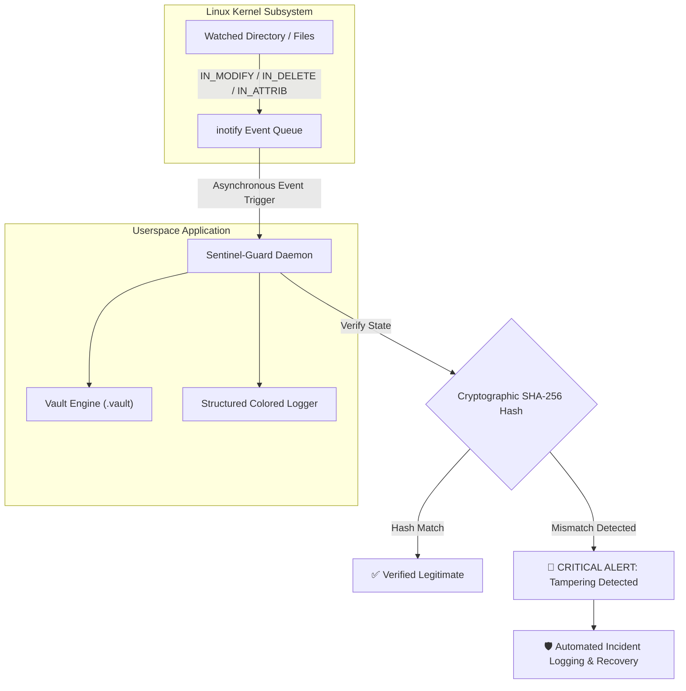

<div align="center">

# 🛡️ Sentinel-Guard

### Real-Time Linux Kernel File Integrity & Anti-Tamper Security Daemon

<p align="center">
  
  
  
  
</p>

<p align="center">
  A high-performance, asynchronous Linux system daemon written in modern C++ (C++17) that hooks directly into the Linux Kernel <code>inotify</code> API to perform real-time File Integrity Monitoring (FIM), instantaneous unauthorized alteration detection via cryptographic hashing, and automated baseline auditing.
</p>

</div>

---

## ⚡ System Architecture & Execution Flow



---

## 🌟 Implemented Core Capabilities

- 🐧 **Zero-Polling Kernel Watcher:** Directly interfaces with Linux `sys/inotify.h` to receive asynchronous file events without wasting CPU cycles.
- 🔐 **Cryptographic SHA-256 Hash Verification:** Generates a secure baseline snapshot inside `.vault` and detects even single-byte unauthorized modifications.
- 🛡️ **Comprehensive Event Interception:**
  - `IN_MODIFY` — Real-time content tamper detection & integrity hash validation.
  - `IN_DELETE` — Immediate notification upon unauthorized deletion of protected system assets.
  - `IN_ATTRIB` — File permission and metadata alteration detection (`chmod`/`chown` changes).
- ⚙️ **Configurable CLI Target Paths:** Monitor custom system directories dynamically using `-d` / `--dir` flags.
- 🛑 **Graceful POSIX Signal Handling:** Clean teardown of kernel descriptors on `SIGINT` (Ctrl+C) and `SIGTERM`.
- 📊 **Enterprise-Grade Terminal Logger:** Colored, formatted logging pipeline for sysadmins and security analysts.

---

## 💻 CLI Usage Preview

```bash
# Monitor default directory
$ ./bin/sentinel-guard

# Monitor a specific sensitive system directory
$ ./bin/sentinel-guard --dir /etc/critical_configs

# View CLI options & manual
$ ./bin/sentinel-guard --help
```

---

## 🛠️ Tech Stack & Engineering Specs

| Domain | Details |
| :--- | :--- |
| **Language** | Modern C++ (C++17 Standard) |
| **System Interfaces** | Linux Kernel `inotify`, POSIX Signals, System Calls |
| **OS Target** | Red Hat Enterprise Linux (RHEL 9) / Fedora / Ubuntu |
| **Build Pipeline** | GNU Make & GCC/G++ Compiler |
| **Security Layer** | SHA-256 Hashing, Permission Baseline Comparison |

---

## 🔒 Confidentiality & Copyright Notice

> [!WARNING]
> **Proprietary Academic & Internship Project • All Rights Reserved**  
> The core algorithms, inotify event loop logic, and vault state engine are confidential intellectual property of **Atul Kumar**. Unauthorized copying, reproduction, or reverse engineering is strictly prohibited under international copyright laws.
> 
> *Full codebase and architecture demonstration available upon authorized request.*

---

<div align="center">
  <sub>Copyright © 2026 <b>Atul Kumar</b> • Red Hat Intern</sub>
</div>
