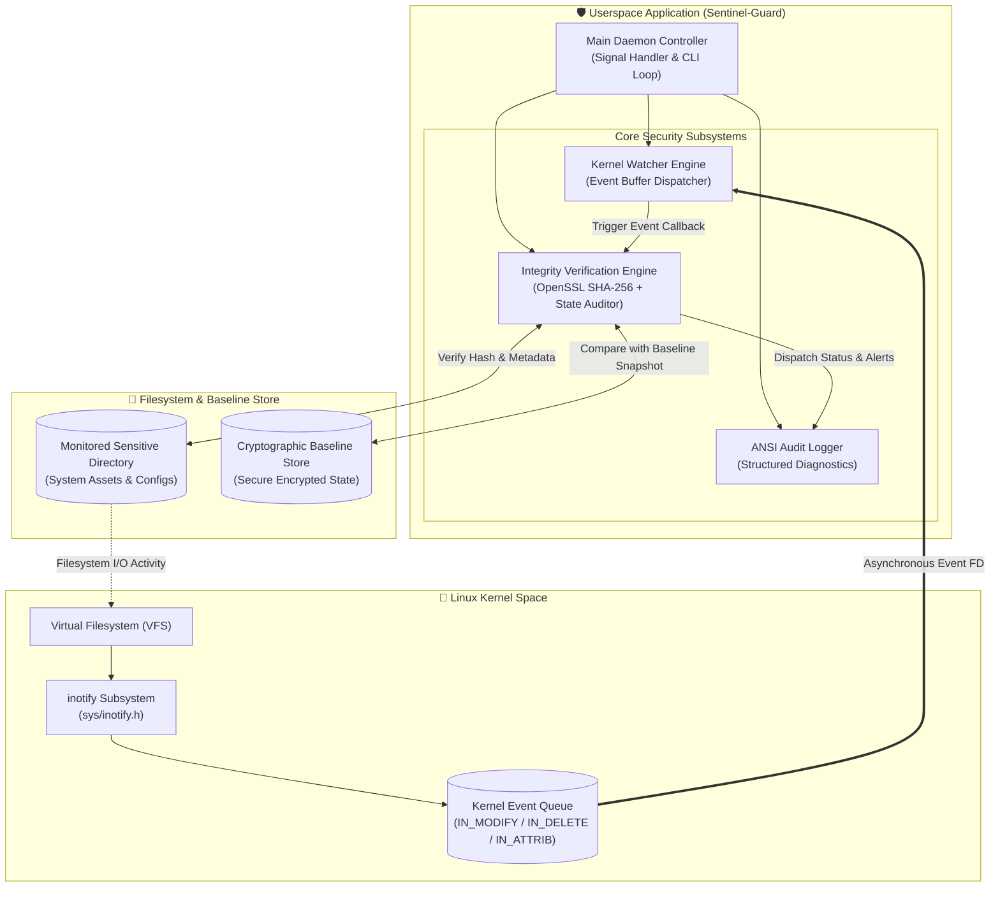
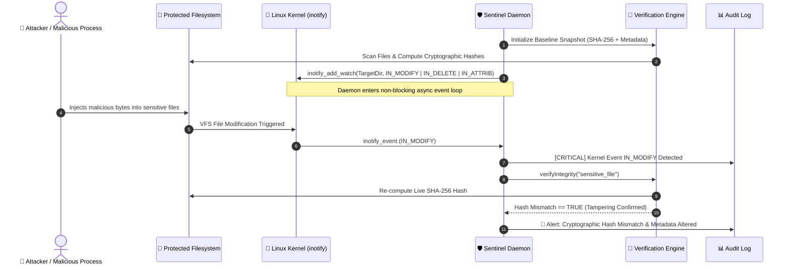

<div align="center">

<!-- 🌟 HEADER BANNER -->


<p align="center">
  
  
  
  
  
</p>

<p align="center">
  <b>Sentinel-Guard</b> is a high-performance, asynchronous Linux system daemon engineered in <b>C++17</b>. It interfaces directly with the <b>Linux Kernel <code>inotify</code> subsystem</b> to deliver real-time File Integrity Monitoring (FIM), instantaneous unauthorized alteration detection via cryptographic SHA-256 baseline auditing, and automated tamper alert pipelines.
</p>

</div>

---

## ⚡ Terminal Live Execution Preview

```
========================================================================
   ____             __  _            __     ______                     __
  / __/__ ___  ___ / /_(_)__  ___   / /    / ____/_ _____ _________  _/ /
 _\ \/ -_) _ \/ -_) __/ / _ \/ -_) / /__  / (_ / // / _ `/ __/ _  / / _ /
/___/\__/_//_/\__/\__/_/_//_/\__/ /____/  \___/\_,_/\_,_/_/  \_,_/ /_//_/ 
========================================================================
[19:10:14] [INFO]     Initializing Sentinel-Guard Daemon v1.0.0...
[19:10:14] [INFO]     Target directory to protect: /etc/security/critical_configs
[19:10:14] [SUCCESS]  Generating SHA-256 Cryptographic Baseline snapshot...
[19:10:14] [SUCCESS]  Attached Linux Kernel inotify watcher [FD: 4, Watch Descriptor: 1]
[19:10:14] [INFO]     Daemon Active. Listening for kernel filesystem events...
------------------------------------------------------------------------
[19:10:22] [CRITICAL] Kernel Event [IN_MODIFY] on: /etc/security/critical_configs/secret.txt
[19:10:22] [CRITICAL] 🚨 SHA-256 HASH MISMATCH DETECTED!
                      Baseline : e3b0c44298fc1c149afbf4c8996fb92427ae41e4...
                      Current  : 8f434346648f6b96df89dda901c5176b10a6d839...
[19:10:22] [WARN]     Kernel Event [IN_ATTRIB] ⚠️  Permissions altered (0644 -> 0777)
[19:10:25] [CRITICAL] Kernel Event [IN_DELETE] 🚨 File removed: /etc/security/critical_configs/config.sys
```

---

## 🏗️ System Architecture & Subsystems



---

## 🔄 Real-Time Threat Interception Lifecycle



---

## 🌟 Core Engineering Capabilities

<div align="center">

| Capability | Technical Implementation | Benefit |
| :--- | :--- | :--- |
| **Zero-Polling Watcher** | Direct Linux Kernel `inotify` API | Zero CPU spinning; purely event-driven architecture |
| **Cryptographic Auditing** | OpenSSL EVP SHA-256 engine | Detects single-bit unauthorized content tampering |
| **Deep Metadata Tracking** | POSIX `stat()` tracking (`mode_t`, `uid`, `gid`) | Identifies permission tampering (`chmod 777`) and ownership changes |
| **Multi-Event Interception** | `IN_MODIFY`, `IN_DELETE`, `IN_ATTRIB`, `IN_CREATE` | Full coverage against file deletion, injection, and corruption |
| **Graceful POSIX Shutdown** | `SIGINT` (Ctrl+C) and `SIGTERM` atomic flags | Prevents resource leaks and cleans up kernel file descriptors |
| **Automated Baseline Store** | Encrypted snapshot state | Retains ground-truth file states for security auditing |

</div>

---

## 🛠️ Technology Stack & Dependencies

```
Languages & Standards : C++ (C++17 Standard), POSIX.1-2008
Kernel Subsystems     : Linux Kernel inotify (sys/inotify.h)
Cryptography          : OpenSSL (libcrypto / EVP Message Digest)
Operating System      : Red Hat Enterprise Linux (RHEL 9) / Fedora / Linux 6.x
Build Tools           : GNU Make, GCC / G++ (v11+)
```

---

## 💻 CLI Options & Usage

```bash
# Display help and CLI options
$ ./bin/sentinel-guard --help

# Monitor default directory
$ ./bin/sentinel-guard

# Monitor a specific sensitive system directory
$ ./bin/sentinel-guard -d /etc/security/critical_configs

# Print version and build specs
$ ./bin/sentinel-guard --version
```

### ⚙️ Command Line Flags:
* `-d, --dir <path>` : Specify target directory path to protect and monitor.
* `-h, --help`       : Display interactive CLI manual and banner.
* `-v, --version`    : Display version and kernel subsystem information.

---

## 🔒 Confidentiality & Intellectual Property Notice

> [!WARNING]
> **Enterprise Internship & Academic Development Project • All Rights Reserved**  
> The core algorithmic implementations, inotify event loop dispatcher, and baseline verification logic are the intellectual property of **Atul Kumar**. 
> 
> Unauthorized reproduction, cloning, or distribution of this software or its internal architecture is strictly prohibited under applicable copyright laws.
> 
> *Authorized demonstration and full codebase inspection are available for recruiters and faculty upon formal request.*

---

<div align="center">
  <sub>Developed & Engineered by <b>Atul Kumar</b> • Red Hat Intern</sub>
</div>
